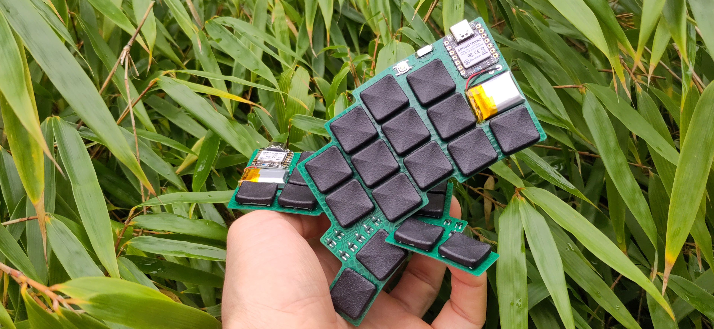

# Zplitzalp

The Zplitzalp is a split, wireless, ultra-low-profile version of [kilipan's](https://github.com/kilipan) [Zilpzalp](https://github.com/kilipan/zilpzalp).
The required Switches are the [Cherry ultra low profile switches](https://www.cherry.de/en-us/products/mx-switches/mx-ultra-low-profile).
The footprint is based on the ones found [here](https://github.com/pashutk/Cherry_MX_ULP/).

# Buildguide
The soldering of the switches has to be done with care.
I recommend to solder the switches by hand with a soldering iron, do not use a small hotplate. If you use a hotplate the thin PCB will bend due to the combination of thermal expansion of the board and the board being warmer on the side of the hotplate.
As it cools down the solder solidifies and the switch will hold the PCB in its bend shape.
I like to solder them by placing the switch on the PCB and soldering at least one of the accessible solder pads from the front.
Then turn the PCB around such that you can see the "Zplitzalp"-text and solder the remaining pads from the bottom.
Solder the pads on the PCB as well as the ones through the cutout.
Be careful not to use to much solder when soldering the pads of the switches. If you use too much solder the switch will not work anymore. Try with one and see whether it still works before soldering in all the switches and potentially ruining all your switches.

A 20x15x5mm battery fits into the cutout. Solder its positive side (red wire) to the pad with the `+` next to it. The negative side of the battery (black wire) needs to be soldered to the pad with the `-` sign.

Solder the [XIAO BLE](https://www.seeedstudio.com/Seeed-XIAO-BLE-nRF52840-p-5201.html) to the boards.
Do not forget the pads on the backside. These need to be soldered through the cutout, just as you did for the switches.

The last thing to solder is the [on-off switch](MSK12C02).

Now it is time to install keycaps. You can get them printed at JLC3DP for relatively little money.
You find the required files in [fookers mnhTTn repository](https://github.com/fooker/mnhttn/tree/main/keycaps).
